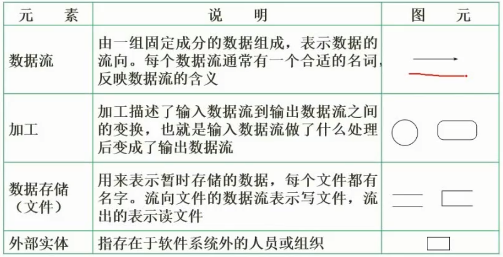
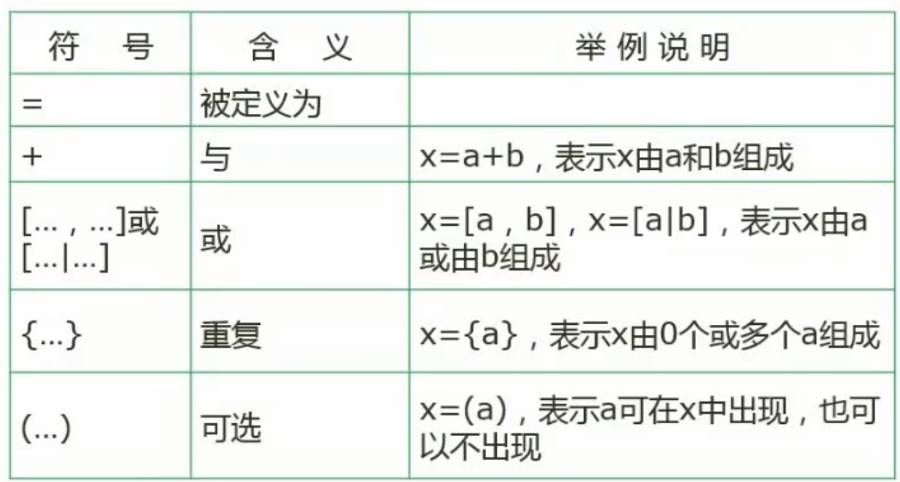
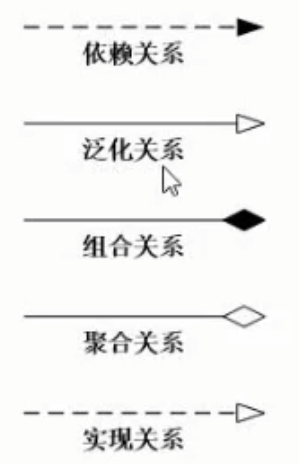
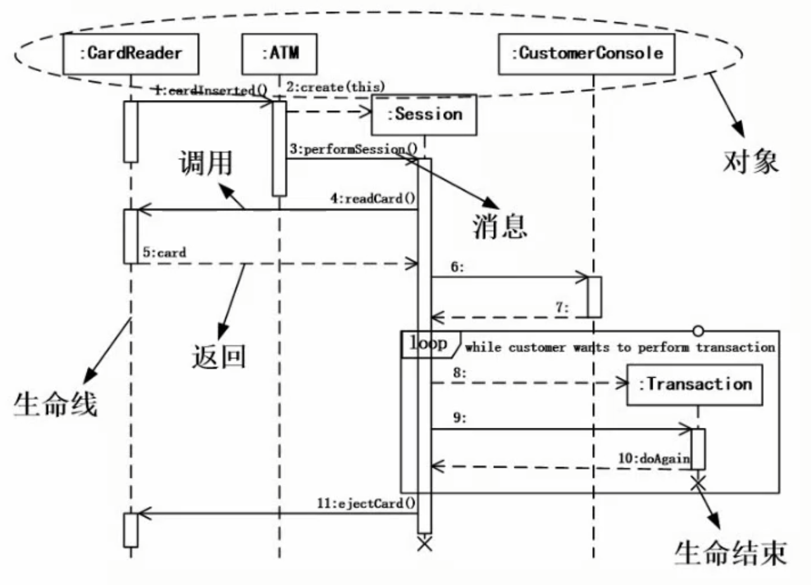
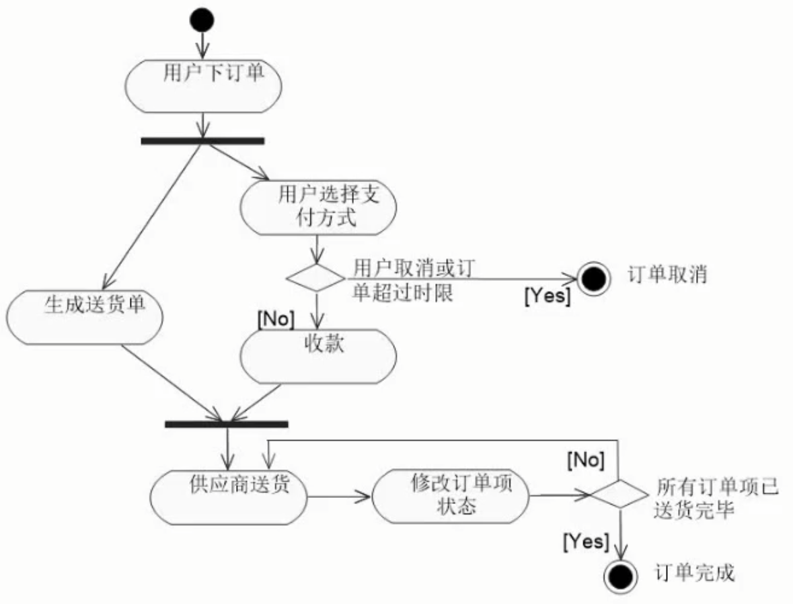
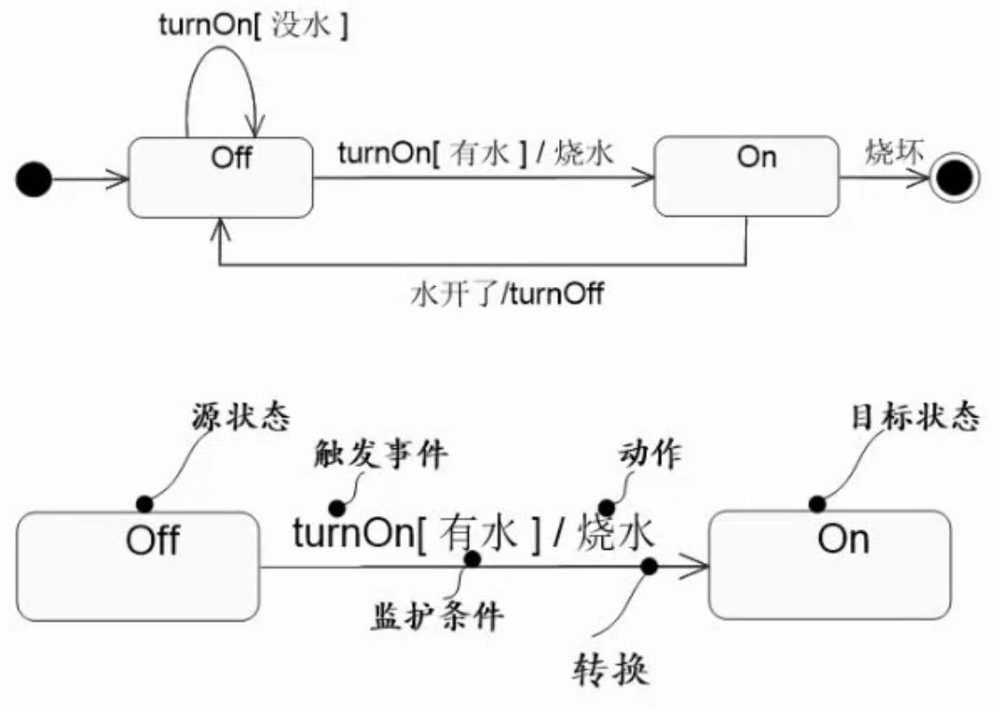
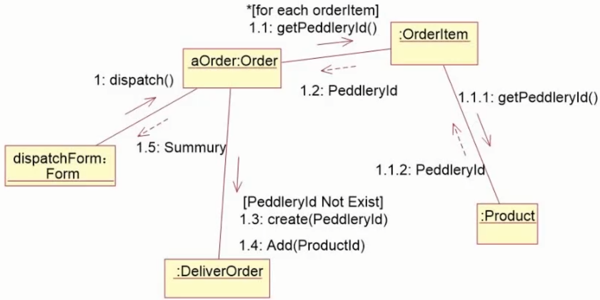

# 计算机组成与体系结构（6分）

## 数据的表示

### 进制的转换

* 二进制转十进制
  $$
  10100.01=1 *2^4+1*2^2+1*2^{-2}
  $$

* 八进制转十进制
  $$
  753 = 7 * 8^2+5*8^1+3*8^1 = 491
  $$

  $$
  
  $$

* 十六进制转十进制
  $$
  2A3 = 2*16^2+A*16^1+3*16^0 = 2*256 + 10 * 16 +3 *1 = 675
  $$
  其中A代表10，B代表11，C代表12，D代表13，E代表14，F代表15

* 十进制转二进制
  $$
  \begin{aligned}
  &2|94 \quad 余 & 0 \\
  &2|47 \quad & 1 \\
  &2|23 \quad & 1 \\
  &2|11 \quad & 1 \\
  &2|5 \quad & 1 \\
  &2|1 \quad & 0 \\
  & \quad1 \\
  结果1011110
  \end{aligned}
  $$

* 二进制转八进制

  从后面开始每3位切割转十进制
  $$
  10001110 \\
  10\quad001\quad110 \\
  2\quad\quad1\quad\quad6
  $$

* 二进制转十六进制

  从后面开始每4位切割转十进制
  $$
  10001110 \\
  1000 \quad 1110 \\
  8 \quad\quad\quad E
  $$

### 编码（原码、反码、补码、移码）

* 原码转反码

  第一位符号位不变后面的取反
  $$
  1000 \quad 0001  \quad 原码\\ 
  1111 \quad 1110  \quad 反码
  $$

* 原码转补码

  在反码的基础上加1
  $$
  1000 \quad 0001  \quad 原码\\ 
  1111 \quad 1110+1 \quad 反码\\
  1111 \quad 1111 \quad 补码
  $$

* 原码转移码

  一般用作浮点运算中的阶码

  在补码的基础上，把首位取反
  $$
  1000 \quad 0001 \quad 原码\\ 
  1111 \quad 1111 \quad 补码 \\
  0111 \quad 1111 \quad 移码 \\
  $$

|      | 数值1     | 数值-1    | 1-1       |
| ---- | --------- | --------- | --------- |
| 原码 | 0000 0001 | 1000 0001 | 1000 0010 |
| 反码 | 0000 0001 | 1111 1110 | 1111 1111 |
| 补码 | 0000 0001 | 1111 1111 | 0000 0000 |
| 移码 | 1000 0001 | 0111 1111 | 1000 0000 |

**取值范围**

|      | 整数                                   |
| ---- | -------------------------------------- |
| 原码 | $-(2^{n-1}-1)$~$2^{n-1}-1$             |
| 反码 | $-(2^{n-1}-1)$~$2^{n-1}-1$             |
| 补码 | $-(2^{n-1})$~$2^{n-1}-1$(有正0，和负0) |

### 浮点数运算

浮点数表示：
$$
N=M*R^e
$$
其中M称为尾数，e是指数，R为基数

**运算流程**

* 对阶
  $$
  1000+119 \rightarrow 1.0*10^3 + 0.119*10^3
  $$

* 尾数计算
  $$
  1+0.119 = 1.119
  $$

* 结果格式化

  首位必须是个位数
  $$
  0.119*10^3 \rightarrow 1.19*10^2 \\
  11.9 * 10 \rightarrow 1.19 *10^2
  $$

## 计算机结构

计算机结构包括CPU和主存储器

CPU包括运算器和控制器

运算器：

* 算术逻辑单元ALU：做运算的
* 累加寄存器AC：
* 数据缓冲寄存器DR：读写主存储器时，暂存主存储器数据
* 状态条件寄存器PSW：存储运算过程中的标记位的

控制器

* 程序计数器PC：存储下一条指令的位置
* 指令寄存器IR
* 指令译码器
* 时序部件

## 体系结构分类-flynn

## CISC与RISC

| 指令系统类型 | 指令                                                         | 寻址方式   | 实现方式                                             | 其他                       |
| ------------ | ------------------------------------------------------------ | ---------- | ---------------------------------------------------- | -------------------------- |
| CISC（负责） | 数量多，使用频率差别大可变长格式                             | 支持多种   | 微程序控制技术（微码）                               | 研制周期长                 |
| RISC（精简） | 数量少，使用频率接近，定长格式，大部分为单调期指令，操作寄存器，只有Load/Store操作内存 | 支持方式少 | 增加了通用寄存器；硬布线逻辑控制为主；适合采用流水线 | 优化编译。有效支持高级语言 |

## 流水线

* 流水线周期为执行时间最长的一段；

* 流水线计算公式：

  1条指令执行时间+（指令条数-1）*流水线周期*

  *理论公式：$(t1+t2+ \cdots + tk)+(n-1)*\Delta t$

  实践公式：$(k+n-1)*\Delta t$

* 吞吐率计算
  $$
  TP=\frac{指令条数}{流水线执行时间}
  $$

* 加速比
  $$
  S=\frac{不使用流水线执行时间}{使用流水线执行时间}
  $$

* 流水线的效率
  $$
  E=\frac{n个任务占用的时空区}{k个流水段的总的时空区} = \frac{T_0}{kT_k}
  $$

## 层次化存储结构

### cache

Cache的功能：提高CPU数据输入输出的速率，突破冯·诺依曼瓶颈，即CPU与存储系统间数据传送带宽限制。

如果以代表对Cache的访问命中率，$t_1$表示Cachel的周期时间，$t_2$表示主存储器周期时间，以读操作为例，使用“Cache+主存储器”的系统的平均周期为$t_3$则：
$$
t_3=h*t_1+(1-h)*t_2
$$
其中，(1-h)又称为失效率（未命中率）。

### 局部性原理

* 时间局部性
* 空间局部性
* 工作集理论：工作集是进程运行是被频繁访问的页面集合

## 主存

### 分类

* 随机存取存储器
  * DRAM (Dynamic RAM,,动态RAM)-SDRAM
  * SRAM(Static RAM,静态)
* 只读存储器
  * MROM (Mask ROM,掩模式ROM)
  * PROM(Programmable ROM,一次可编程ROM)
  * EPROM(Erasable PROM,可擦除的PROM)
  * 闪速存储器(flash memory,闪存)

### 编址

$$
C7FFFH+1=C8000H  \\
\begin{aligned}
&C8000H-AC000H \\
&(8-C,8小于C需要往前借一位等于16+8=24,C=12，即24-12=12,所以为C)\\
&(B-A=1) \\
=& 1C000H \\
\end{aligned} \\
\begin{aligned}
&1C000H \div 2^{10} \\
= &(1*16^4+12*16^3)\div 2^{10} \\
= &(1*2^{4*4}+12*2^{4*3})\div 2^{10} \\
= &(2^{16}+12*2^{12})\div 2^{10} \\
= &(2^{16-10}+12*2^{12-10}) \\
= &(2^{6}+12*2^{2}) \\
= &(64+12*4) \\
= &(64+48) \\
=& 112
\end{aligned}
$$

$$
\begin{aligned}
 1 &= \frac{112K \times 16}{28 \times 16K \times x}  \\
 & = \frac{112}{28 \times x} \\
 & = \frac{4}{x} \\
& x = 4
\end{aligned}
$$

## 磁盘结构与参数

存取时间=寻道时间+等待时间（平均定位时间+转动延迟）
注意：寻道时间是指磁头移动到磁道所需的时间；等待时间为等待读写的扇区转到磁头下方所用的时间。

$33ms \div 11 = 3ms$，得到每个物理块读取数据的时间为$3ms$，也就是说磁头从$R_0$开始到$R_1$开始，用了$3ms$读完数据到缓冲区，等缓冲区处理完，并且需要磁头再转一圈到大$R_1$开始处才能再读取数据。所以读完物理块1到10的数据为
$$
(33ms+3ms)*10 = 360ms
$$
此时磁头到达$R_{11}$开始处，读取数据需要$3ms$，缓冲区处理时间需要$3ms$，所以处理完11个记录的时间为
$$
360ms+3ms+3ms = 366ms
$$

优化后的存储顺序为$R_{0},R_{6},R_{1},R_{7},R_{2},R_{8},R_{3},R_{9},R_{4},R_{10},R_{5}$，磁头只需转两圈就可以读取完全部数据，需要时间为
$$
33ms*2 = 66ms
$$

## 总线

总线通常被分成三种类型，分别是

* 内部总线
* 系统总线
  * 数据总线
  * 地址总线
  * 控制总线
* 外部总线

## 系统可靠性分析

### 串联系统

可靠度：
$$
R=R_1 \times R_2 \times \cdots \times R_n
$$
失效率：
$$
\lambda = \lambda_1 \times \lambda_2 \times \cdots \times \lambda_n 
$$

### 并联系统

可靠度：
$$
R=1-(1-R1) \times (1-R_2) \times \cdots \times (1-R_n)
$$
失效率：
$$
\mu = \frac{1}{\frac{1}{\lambda}\sum_{j=1}^n\frac{1}{j}}
$$

## 模冗余系统-了解

$$
R=\sum_{i=n+1}^mC_m^j \times R_0^i(1-R_0)^{m-i}
$$

### 混合系统-重点

$$
R \times (1-(1-R)^3) \times (1-(1-R)^2)
$$

## 差错控制

### 循环校验码CRC

### 海敏校验码

校验位的位置为$2^n$

校验位的位数和信息位的位数关系：
$$
2^r \geq 4+r+1
$$
其中$r$为校验位的位数

# 操作系统（7分）

## 进程管理

### 进程的状态

### 前趋图

表达哪些任务可以先运行，任务间运行的先后顺序。

### 进程的同步与互斥

- 在多道程序环境下，操作系统必须采取相应措施处理好进程之间的制约关系。
- 进程同步的主要任务是对多个有制约关系的进程在执行次序上进行协调，以使并发进程间能有效地、安全地互相合作和共享系统资源。

| 同步                                                         | 互斥                                                         |
| ------------------------------------------------------------ | ------------------------------------------------------------ |
| 进程与进程之间有序合作                                       | 进程与进程之间共享临界资源                                   |
| 相互清楚对方的存在及其作用,直接合作                          | 不清楚对方的情况，只是共享同一临界资源                       |
| 多个进程合作完成一个任务                                     | 各个进程之间没有任何合作工作                                 |
| 例如：发送消息进程和接受消息进程之间；输入进程、计算进程和输出进程之间等。 | 例如：共享打印机的若干进程之间；共享同一全局变量的若干进程之间等。 |

### PVC操作

* 临界资源：诸进程间需要互斥方式对其进行共享的资源，如打印机、磁带机等
* 临界区：每个进程中访问临界资源的那段代码称为临界区
* 信号量：是一种特殊的变量

### 死锁问题

进程管理是操作系统的核心，但如果设计不当，就会出现死锁的问题。如果一个进程在等待一件不可能发生的事，则进程就死锁了。而如果个或多个进程产生死锁，就会造成系统死锁。

### 银行家算法

* 当一个进程对资源的最大需求量不超过系统中的资源数时可以接纳该进程
* 进程可以分期请求资源，但请求的总数不能超过最大需求量
* 当系统现有的资源不能满足进程尚需资源数时，对进程的请求可以推迟分配，但总能使进程在有限的时间里得到资源

## 存储管理

### 分区存储组织

### 页式存储组织

优点：利用率高，碎片小，分配及管理简单
缺点：增加了系统开销：可能产生抖动现象

页面大小为4K，转二进制为$2^{12}$，逻辑地址为十六进制所以再转十六进为$2^{4*3}=16^3$，所以逻辑地址5A29H转物理地址的后三位不变为A29H，剩余的第一位5，根据表格中的页号5对应的页帧号为6，所以物理地址为6A29H。

页面4不在内存中，优先淘汰在内存中筛选状态位为1的，然后是没有访问过的访问位为0的，所以淘汰1

### 段式存储

优点：多道程序共享内存，各段程序修改互不影响
缺点：内存利用率低，内存碎片浪费大

### 段页式存储

优点：空间浪费小、存储共享容易、存储保护容易、能动态连接
缺点：由于管理软件的增加，复杂性和开销也随之增加，需要的硬件以及占用的内容也有所增加，使得执行速度大大下降

### 块表

快表是一块小容量的相联存储器(Associative Memory),由高速缓存器组成速度快，并且可以从硬件上保证按内容并行查找，一般用来存放当前访问最频繁的少数活动页面的页号。

### 页面置换算法

* 最优(Optimal,OPT)算法
* 随机(RAND)算法
* 先进先出（FIFO)算法：有可能产生“抖动”。例如，432143543215序列，用3个页面，比4个缺页要少
* 最近最少使用(LU)算法：不会“抖动”

没有使用块表，说明先要在内存上查表，再根据表，读取相应的内存块，所以每个块需要进行两次的内存访问，一共有6个块所以要进行12次访问。

默认指令不会产生中断所以swapA,B中断了1次，A块和A块夸内存各中断2次，所以一共中断了5次。

## 文件管理

### 索引文件结构

索引节点包括直接索引、一级间接索引、二级间接索引、三级间接索引。

索引节点一般为13各结点，假设一个物理盘块为4K，

规定0-9结点为直接索引可以存为$4K*10=40K$

10节点为一级间接索引，假设每个地址占4各字节，一个物理盘块可以存$4K \div 4 = 1024$物理盘地址，可以存$4K \times 1024 = 4096K$

11节点为二级间接索引可以存$4K \times 1024 \times 1024$

12节点为三级间接索引可以存$4K \times 1024 \times 1024 \times 1024$

### 空闲存储空间的管理

$$
(4195+1) \div 32 = 131.125
$$
所以为132。

因为要占用物理块，所以取值“1”，
$$
131 \times 32 =4192
$$
第0位置是4192，第1位置是4193，第2位置是4194，第3位置是4195

## 设备管理

### 数据传输控制方式

* 程序控制方式
* 程序中断方式
* DMA方式
* 通道
* 输入输出处理机

### 虚设备与SPOOLING技术

# 数据库系统

## 三级模式

* 外模式
  * 数据库的用户使用的局部数据的逻辑结构和特征的描述 
  * 数据库用户的数据视图，是与某一应用程序有关的数据的逻辑表示。
* 概念模式
  * 它是数据库中全体数据的逻辑结构和特征的描述；
  * 模式是所有用户的公共数据视图。因为数据库是多人共享使用的，模式就是大家都看到的样子，综合了所有用户的数据需求。
* 内模式
  * 数据物理结构和存储方式的描述 
  * 是数据在数据库内部的表示方式
    * 记录的存储方式：如顺序存储，按B树结构存储，Hash存储）
    * 索引的组织方式：B+树索引，hash索引，Join index索引 
    * 数据是否压缩存储
    * 数据是否加密

### 两级映射

* 外模式/概念模式映射

  保证了数据的逻辑独立性。当模式改变时，数据库管理员修改有关的外模式/模式映像，使外模式保持不变；而应用程序是根据数据的外模式编写的，从而应用程序不必修改，保证了数据与应用程序的逻辑独立性，简称为数据的逻辑独立性。

* 概念模式/内模式映射

  保证了数据的物理独立性。 

  * 当数据的存储结构改变时（如本来我们用堆存储，改成了B+树），数据库管理员修改模式/内模式映像，使模式保持不变。 
  * 应用程序不受影响，保证了数据与程序的物理独立性，简称为数据的物理独立性。

## 数据库的设计

### E-R模型

 

**集成的方法**：

* 多个局部E-R图一次集成。
* 逐步集成，用累加的方式一次集成两个局部E-R。

**集成产生的冲突及解决办法**：

* 属性冲突：包括属性域冲突和属性取值冲突。
* 命名冲突：包括同名异义和异名同义。
* 结构冲突：包括同一对象在不同应用中具有不同的抽象，以及同一实体在不同局部E-R图中所包含的属性个数和属性排列次序不完全相同。

**一个实体型转换为一个关系模式**

* 1:1联系
* 1:n联系
* m:n联系

**三个以上实体间的一个多元联系**

 ### 关系代数

* 并
* 交
* 差
* 笛卡尔乘积
* 投影
* 选择
* 联接

## 规范化理论

### 函数依赖

设R(U)是属性U上的一个关系模式，X和Y是U的子集，r为R的任一关系，如果对于r中的任意两个元组u,v,只要有u[X]=v[X],就有u[Y门=v[Y],则称X函数决定Y,或称Y函数依赖于X,记为X→Y。

### 价值与用途

## 键

* 主键：唯一标识
* 候选键：
  * 将关系模式的函数依赖关系用“有向图”的方式表示
  * 找入度为0的属性，并以该属性集合为起点，尝试遍历有向图，若能正常遍历图中所有结点，则该属性集即为关系模式的候选键
  * 若入度为0的属性集不能遍历图中所有结点，则需要尝试性的将一些中间结点（既有入度，也有出度的结点）并入入度为0的属性集中，直至该集合能遍历所有结点，集合为候选键
* 外键：其他关系的主键

## 范式

* 1NF：在关系模式R中，当且仅当所有域只包含原子值，即每个分量都是不可再分的数据项，则称R是第一范式。
* 2NF：当且仅当R是1NF,且每一个非主属性完全依赖主键（不存在部分依赖)时，则称R是第二范式。
* 3NF：第三范式(3NF)：当且仅当R是1NP,且E中没有非主属性传递依赖于码时，则称R是第三范式。
* BCNF：设R是一个关系模式，F是它的依赖集，R属于BCNF当且仅当其F中每个依赖的决定因素必定包含R的某个候选码。

由上往下逐步优化，已解决插入异常、删除异常、数据冗余

 ## 模式分解

* 保持函数依赖分解
  设数据库模式p={R1,R2,…,R}是关系模式R的一个分解，F是R上的函数依赖集，p中每个模式Ri上的FD集是Fi。如果{F1,F2,,Fk}与F是等价的（即相互逻辑蕴涵），那么称分解p保持FD
* 无损分解
  什么是有损，什么又是无损？
  有损：不能还原。
  无损：可以还原。
* 无损联接分解：指将一个关系模式分解成若干个关系模式后，通过自然联接和投影等运算仍能还原到原来的关系模式

## 并发控制

事务

* 原子性
* 一致性
* 隔离性
* 持续性

封锁协议

* 一级封锁协议。事务T在修改数据R之前必须先对其加区锁，直到事务结束才释放。可防止丢失修改
* 二级封锁协议。一级封锁协议加上事务T在读取数据R之前先对其加S锁，读完后即可释放$锁。可防止丢失修改，还可防止读“脏”数据
* 三级封锁协议。一级封锁协议加上事务T在读取数据R之前先对其加S锁，直到事务结束才释放。可防止丢失修改、防止读“脏”数据与防止数据重复读
* 两段锁协议。可串行化的。可能发生死锁

## 整性约束

* 实体完整性约束
* 参照完整性约束
* 用户自定义完整性约束
* 触发器

## 数据库安全

| 措施           | 说明                                                         |
| -------------- | ------------------------------------------------------------ |
| 用户标识和鉴定 | 最外层的安全保护措施，可以使用用户帐户、口令及随机数检验等方式 |
| 存取控制       | 对用户进行授权，包括操作类型（如查找、插入、删除、修改等动作)和数据对象（主要是数据范围）的权限。 |
| 密码存储和传输 | 对远程终端信息用密码传输                                     |
| 视图的保护     | 对视图进行授权                                               |
| 审计           | 使用一个专用文件或数据库，自动将用户对数据库的所有操作记录下来 |

## 数据备份

|        | 优点                                                         | 缺点                                                         |
| ------ | ------------------------------------------------------------ | ------------------------------------------------------------ |
| 冷备份 | 非常快速的备份方法（只需复制文件）；容易归档（简单复制即可）：容易恢复到某个时间点上（只需将文件再复制回去）：能与归档方法相结合，做数据库”最佳状态”的恢复；低度维护，高度安全 | 单独使用时，只能提供到某一时间点上的恢复；在实施备份的全过程中，数据库必须要作备份而不能做其他工作：若磁盘空间有限只能复制到磁带等其他外部存储设备上，速度会很慢；不能按表或按用户恢复 |
| 热备份 | 可在表空间或数据库文件级备份，备份的时间短：备份时数据库仍可使用：可达到秒级恢复（恢复到某一时间点上）；可对几乎所有数据库实体做恢复；恢复是快速的 | 不能出错，否则后果严重；若热备份不成功所得结果不可用于时间点的恢复：因难于维护，所以要特别小心，不允许“以失败告终” |

* 完全备份：备份所有数据
* 差量备份：仅备份上一次完全备份之后变化的数据
* 增量备份：备份上一次备份之后变化的数据

1. 静态海量转储：在系统中无运行事务时进行，每次转储全部数据库。
2. 静态增量转储：在系统中无运行事务时进行，每次只转储上一次转储后更新过的数据。
3. 动态海量转储：转储期间允许对数据库进行存取或修改，每次转储全部数据库。
4. 动态增量转储：转储期间允许对数据库进行存取或修改，每次只转储上一次转储后更新过的数据。

日志文件：事务日志是针对数据库改变所做的记录，它可以记录针对数据库的任何操作，并将记录结果保存在独立的文件中

## 反规范化

由于规范化会使表不断的拆分，从而导致数据表过多。这样虽然减少了数据冗余，提高了增、删、改的速度，但会增加查询的工作量。系统需要进行多次连接，才能进行查询操作，使得系统效率大大下降

* 增加派生性冗余列
* 增加冗除列
* 重新组表
* 分割表

# 计算机网络

## OSI/RM七层模型

## 网络技术标准与协议

## 计算机网路的分类-拓扑结构

按分布范围分

* 局域网（LAN）
* 城域网（MAN）
* 广域网（WAN）
* 因特网

按拓扑结构分

* 总线型

  

* 星型

  

* 环型

  

## IP地址与子网

# 信息系统安全分析与设计

## 安全属性

* 保密性：最小授权原则、防暴露、信息加密、物理保密
* 完整性：安全协议、校验码、密码校验、数字签名、公证
* 可用性：综合保障(IP过滤、业务流控制、路由选择控制、审计跟踪)
* 不可抵赖性：数字签名

## 对称加密与非对称加密.

常见对称密钥加密算法：

* DES:替换+移位、56位密钥、64位数据块、速度快、密钥易产生
  3DES(三重DES):两个56位的密钥K1、K2
  加密：K1加密->K2解密->K1加密
  解密：K1解密->K2加密->K1解密
* AES:高级加密标准Rijndaeli加密法，是美国联邦政府采用的一种区块加密标准。这个标准用来替代原先的DES。对其要求是"至少与3DES一样安全"。
* RC-5:RSA数据安全公司的很多产品都使用了RC-5。
* IDEA算法：128位密钥、64位数据块、比DES的加密性好、对计算机功能要求相对低，PGP。

常见非对称密钥加密算法：

* RSA:512位（或1024位）密钥、计算量极大、难破解
* Elgamal:其基础是Diffie-Hellman密钥交换算法
* ECC:椭圆曲线算法
* 其它非对称算法包括：背包算法、Rabin、D-H

## 信息摘要

单向散列函数（单向Hash函数）、固定长度的散列值。

## 数字签名

因为公钥是公开的所以不具有保密性。

用A的私钥加密，只能用A的公钥解密。

## 数字信封与PGP

* 发送方将原文用对称密钥加密传输，而将对称密钥用接收方公钥加密发送给对方。

* 接收方收到电子信封，用自己的私钥解密信封，取出对称密钥解密得原文。

  

* PGP可用于电子邮件，也可以用于文件存储。采用了杂合算法，包括DEA、RSA、MD5、ZIP数据压缩算法。

* PGP承认两种不同的证书格式：PGP证书和x.509证书。

* PGP证书包含PGP版本号、证书持有者的公钥、证书持有者的信息、证书拥有者的数字签名、证书的有效期、密钥首选的对称加密算法。

* X.509证书包含证书版本、证书的序列号、签名算法标识、证书有效期、以下数据：证书发行商名字、证书主体名、主体公钥信息、发布者的数字签名。

## 网络层次的安全保障

## 网络威胁与攻击

| 威胁名称         | 描述                                                         |
| ---------------- | ------------------------------------------------------------ |
| 重放攻击(ARP)    | 所截获的某次合法的通信数据拷贝，出于非法的目的而被重新发送。 |
| 拒绝服务(DOS)    | 对信息或淇它资源的合法访问被无条件地阻止。                   |
| 窃听             | 用各种可能的合法或非法的手段窃取系统中的信息资源和敏感信息。例如对通信线路中传输的信号进行搭线监听，或者利用通信设备在工作过程中产生的电磁泄露截取有用信息等。 |
| 业务流分析       | 通过对系统进行长期监听，利用统计分析方法对储如通信频度、通信的信息流向、通信总量的变化等参数进行研究，从而发现有价值的信息和规律。 |
| 信息泄露         | 信息被泄露或透露给某个非授权的实体。                         |
| 破坏信息的完整性 | 数据被非授权地进行增删、修改或破坏而受到损失。               |
| 非授权访问       | 某一资源被某个非授权的人、或以非授权的方式使用。             |
| 假冒             | 通过欺骗通信系统（或用户）达到非法用户冒充成为合法用户，或者特权小的用户冒充成为特权大的用户的目的。黑客大多是采用假冒进行攻击。 |
| 旁路控制         | 攻击者利用系统的安全缺陷或安全性上的脆弱之处获得非授权的权利或特权。例如，攻击者通过各种攻击手段发现原本应保密，但是却又暴露出来的一些系统“特性”。利用这些“特性”，攻击者可以绕过防线守卫者侵入系统的内部。 |
| 授权侵犯         | 被授权以某一目的使用某一系统或资源的某个人，却将此权限用于其它非授权的目的，也称作“内部攻击”。 |
| 特洛伊木马       | 软件中含有一个察觉不出的或者无害的程序段，当它被执行时，会破坏用户的安全。 |
| 陷阱门           | 在某个系统或煤个部件中设置了“机关”，使得当提供特定的输入数据时允许违反安全策略。 |
| 抵赖             | 这是一种来自用户的攻击，比如：否认自己曾经发布过的某条消息、伪造一份对方来信等。 |

## 防火墙

* 网络级
  * 包过滤
  * 状态检测
* 应用级
  * 双穴主机
  * 屏蔽主机
  * 屏蔽子网

# 数据结构与算法基础

## 数组

| 数组类型          | 存储地址计算                                                 |
| ----------------- | ------------------------------------------------------------ |
| 一维数组a[n]      | a[i]的存储地址为：a+i*len （len为各元素占得字节数）          |
| 二维数组a\[m\][n] | a\[i\]\[j\]的存储地址（按行存储）为：a+(i\*n+j)\*len a\[i\]\[j\]的存储地址（按列存储)为：a+(\*m+i)\*Ien |

## 稀疏矩阵

## 线性表

* 顺序表
* 链表
  * 单链表
  * 循环链表
  * 双向链表

### 顺序存储与链式存储

## 队列与栈

* 队列：先进先出

* 栈：先进后出

  

**循环队列**：头指针和尾指针指向同一个位置

队空：head=tail

队满：(tail+1)%size=head

## 广义表

广义表是n个表元素组成的有限序列，是线性表的推广。
通常用递归的形式进行定义，记做：$LS=(a_o,a_1,\cdots,a_n)$。

## 树与二叉树

* 结点的度：结点有多少个分子就是有多少度
* 树的度：树中结点的度最大的为树的度
* 叶子结点：没有子结点的
* 分支结点：有子结点的
* 内部结点：非叶子结点和根结点，中间的结点
* 父结点
* 子结点
* 兄弟结点
* 层次

二叉树的重要特性：

1. 在二叉树的第i层上最多有$2^{i-1}$个结点(i≥1)
2. 深度为k的二叉树品多有$2^{k-1}$个结点(k≥1)
3. 对任何一棵二叉树，如果其叶子结点数为$n_0$，度为2的结点数为$n_2$,则$n_0=n_2+1$
4. 如果对一棵有个结点的完全二叉树的结点按层序编号（从第1层到$\lfloor log2n+1 \rfloor层，每层从左到右），则对任一结
   点$i(1\leq i \leq n)$,有：
   * 如果i=1,则结点无父结点，是二叉树的根：如果i>1，则父结点是$\lfloor i/2 \rfloor $：
   * 如果2i>n,则结点为叶子结点，无左子结点：否则，其左子结点是结点2i:
   * 如果2i+1>n,则结点无右子叶点，否则，其右子结点是结点2i+1。

## 满二叉树

所有结点都是满的

## 安全二叉树

除叶子结点外的其他结点都是满的，叶子结点必须由左往右填充的

## 二叉树的遍历

* 前序遍历：先访问根节点，再访问左结点，再访右问结点
* 中序遍历：先访问左结点，再访问根节点，再访问右结点
* 后序遍历：先访问左结点，再访问右结点，再访问根节点
* 层次遍历

## 反向构造二叉树

需要知道二叉树的前序遍历和中序遍历，步骤：

1. 在前序遍历中找都第一个元素，作为根结点；
2. 在中序遍历找到根结点，将中序遍历分为两半，在根结点左边的是根结点的左结点树，在根结点右边的是根结点的右结点树。
3. 重复第1,2步将构造第2步划分的左结点树和右结点树

## 树转二叉树

* 孩子结点-左子树结点
* 兄弟结点-右孩子结点

## 查找二叉树

* 二叉排序树
* 左孩子小于根
* 右孩子大于根

**插入结点**

* 若该键值结点已存在，则不再插入，如：48
* 若查找二叉树为空树，则以新结点为查找二叉树
* 将要插入结点键值与插入后父结点键值比较，就能确定新结点是父结点的左子结点，还是右子结点。

**删除结点**

* 若待删除结点是叶子结点，则直接删除
* 若待删除结点只有一个子结点，则将这个子结点与待删除结点的父结点直接连接，如：56
* 若待删除的结点有两个子结点，则在其左子树上，用中序遍历寻找关键值最大的结点s,用结点s的值代替结点P的值，然后删除节点s,节点s必属于上述①，②情况之一，如89。

## 最优二叉树（哈夫曼树）

需要了解的基本概念：

* 树的路径长度
* 权
* 带权路径长度
* 树的带权路径长度（树的代价）

构造最优二叉树步骤：

1. 在权值中取出两个最小的，并将这两个权值相加得到新的权值
2. 新的权值作为父结点，最小的两个权值中，大的作为左子结点，小的作为右子结点。
3. 将新的权值放回全部权值中，删除刚刚取出两个最小的权值。重复第1,2步骤构造最优二叉树步骤

## 平衡二叉树

* 任意结点的左右子树深度相差不超过1
* 每结点的平衡度只能为-1、0或1

## 图

有向图：边是有箭头的

无向图：边是没有箭头的

完全图

* 在无向图中，若每对顶点之间都有一条边相连，则称该图为完全图(complete graph)。
* 在有向图中，若每对顶点之间都有二条有向边相互连接，则称该图为完全图。

### 图的存储-邻接矩阵

用一个阶方阵R来存放图中各结点的关联信息，其矩阵元素$R_{ij}$定义为

### 图的存储-邻接表

首先把每个顶点的邻接顶点用链表示出来，然后用一个一维数组来顺序存储上面每个链表的头指针。

### 图的遍历

 

### 拓扑排序

我们把用有向边表示活动之间开始的先后关系。这种有向图称为用顶点表示活动网络，简称AOV网络。

## 算法

**时间复杂度**是指程序运行从开始到结束所需要的时间。通常分析时间复杂度的方法是从算法中选取一种对于所研究的问题来说是基本运算的操作以该操作重复执行的次数作为算法的时间度量。一般来说，算法中原操作重复执行的次数是规模的某个函数T(n)。由于许多情况下要精确计算T(n)是困难的，因此引入了渐进时间复杂度在数量上估计一个算法的执行时间。其定义如下：

如果存在两个常数c和m,对于所有的n,当n≥m时有$f(n)≤cg(n)$则有$f(n)=O(g(n))$。也就是说，随着n的增大，f(n)渐进地不大于g(n)。例如，一个程序的实际执行时间为$T(n)=3n^3+2n^2+n$,则$T(n)=o(n^3)$。
常见的对算法执行所需时间的度量
$O(1)<O(\log_2n)<O(n)<O(n\log_2n)<O(n^2)<O(n^3)<O(2^n)$

**空间复杂度**是指对一个算法在运行过程中临时占用存储空间大小的度量一个算法的空间复杂度只考虑在运行过程中为局部变量分配的存储空间的大小

## 顺序查找

顺序查找的思想：将待查找的关键字为key的元素从头到尾与表中元素进行比较，如果中间存在关键字为key的元素，则返回成功：否则，则查找失败。

时间复杂度为$O(n)$

## 二分查找

时间复杂度为$O(\log_2n)$

## 散列表

散列表查找的基本思想是：已知关键字集合U,最大关键字为，设计一个函数Hash,它以关键字为自变量，关键字的存储地址为因变量，将关键字映射到一个有限的、地址连续的区间$T[0\cdots n-1](n<<m)$中，这个区间就称为散列表，散列查找中使用的转换函数称为散列函数。

## 排序

### 直接插入法

即当插入第i个记录时，$R_1,R_2,\cdots,R_{n-1}$均已好序，因此，将第个记录R依次与$R_{n-1},\cdots,R_2,R_1$进行比较，找到合适的位置插入。它简单明了，但速度很慢。

### 希尔排序

先取一个小于n的整数$d_1$作为第一个增量，把文件的全部记录分成$d_1$个组。所有距离为$d_1$的倍数的记录放在同一个组中。先在各组内进行直接插入排序然后，取第二个增量$d_2<d_1$重复上述的分组和排序，直至所取的增量$d_t=1(d_t<d_{t-1}<O<d_2<d_1)$,即所有记录放在同一组中进行直接插入排序为止。该方法实质上是种分组插入方法。

### 直接选择排序

直接选择排序的过程是，首先在所有记录中选出排序码最小的记录，把它与第1个记录交换，然后在其余的记录内选出排序码最小的记录，与第2个记录交换...依次类推，直到所有记录排完为止。

### 冒泡排序

通过相邻元素之间的比较和交换，将排序码较小的元素逐渐从底部移向顶部。由于整个排序的过程就像水底下的气泡一样逐渐向上冒，因此称为冒泡算法。

### 快速排序

快速排序采用的是分治法，其基本思想是将原问题分解成若干个规摸更小但结构与原问题相似的子问题。通过递归地解决这些子问题，然后再将这些子问题的解组合成原问题的解。
快速排序通常包括两个步骤：

1. 在待排序的个记录中任取一个记录，以该记录的排序码为准，将所有记录都分成两组，第1组都小于该数，第2组都大于该数，如图所示。
2. 采用相同的方法对左、右两组分别进行排序，直到所有记录都排到相应的位置为止

### 归并排序

归并也称为合并，是将两个或两个以上的有序子表合并成一个新的有序表。若将两个有序表合并成一个有序表，则称为二路合并。合并的过程是：比较A[i]和A[j]的排序码大小，若A[i]的排序码小于等于A[j]的排序码，则将第一个有序表中的元素A[i]复制到R[k]中，并令和k分别加1；如此循环下去，直到其中一个有序表比较和复制完，然后再将另一个有序表的剩余元素复制到R中。

# 程序设计语言与语言处理程序基础前言

## 遍历过程

* 词法分析

  正规式，有限自动机

* 语法分析

  根据语言语法规则

* 语义分析

  语义检查

* 中间代码生成

* 代码优化

* 目标代码生成

## 文法定义

## 语法推导树

棵语法树应具有以下特征：
1.每个结点都有一个标记，此标记是V的一个符号：
2根的标记是S;
3.若一结点n至少有一个它自己除外的子孙，并且有标记A,则A肯定在V中：
4如果结点n的直接子孙，从左到右的次序是结点$n_1,n_2,\cdots,n_k$其标记分别是：$A_1,A_2,\cdots,A_K$那么$A->A_1,A_2,\cdots A_K$一定是P中的一个产生式。

## 有限自动机

$M=(S,\sum，δ，S0,Z)$

1. S是一个有限集，每个元素为一个状态
2. $\sum$是一个有穷字母表，每个元素为一个输入字符
3. δ是转换函数：是一个单值对照
4. S0,属于S,是其唯一的初态
5. Z是一个终态集（可空）

## 正规式

A选项
$$
S \rightarrow aA & aA \\
A \rightarrow bS & abS \\
S \rightarrow aA & abaA \\
A \rightarrow bS & ababS \\
S \rightarrow aA & ababaA \\
A \rightarrow b & ababab \\
$$
B选项
$$
S \rightarrow bB & bB \\
B \rightarrow aS & baS \\
S \rightarrow bB & babB \\
B \rightarrow aS & babaS \\
S \rightarrow bB & bababB \\
B \rightarrow a & bababa \\
$$
C选项
$$
S \rightarrow aA & aA \\
A \rightarrow bS & abS \\
S \rightarrow bB & abbB \\
B \rightarrow aS & abbaS \\
S \rightarrow aA & abbaaA \\
A \rightarrow b & abbaab \\
$$

## 函数调用(传值与传址)

* 传值调用
  形参取的是实参的值，形参的改变不会导致调用点所传的实参的值发生改变
* 引用（传址）
  形参取的是实参的地址，即相当于实参存储单元的地址圬引用调用因此其值的改变同时就改变了实参的值

# 法律法规

## 知识产权

* 著作权及邻接权；
* 专利权:
* 工业品外观设计权：
* 商标权：
* 地理标志权
* 集成电路布图设计权

## 保护期限

## 知识产权人确定

## 侵权判定

* 中国公民、法人或者其他组织的作品，不论是否发表，都享有著作权。
* 开发软件所用的思想、处理过程、操作方法或者数学概念不受保护

著作权法不适用于下列情形：

* 法律、法规，国家机关的决议、决定、命令和其他具有立法、行政、司法性质的文件，及其官方正式译文；
* 时事新闻：
* 历法、通用数表、通用表格和公式。

# 多媒体基础

## 媒体的种类

* 感觉媒体：指人们接触信息的感觉形式。如：视觉、听觉、触觉、嗅觉和味觉等。
* 表示媒体：指信息的表示形式。如：文字、图形、图像、动画、音频和视频等。
* 显示媒体（表现媒体）：表现和获取信息的物理设备。如：输入显示媒体键盘、鼠标和麦克风等；输出示媒体显示器、打印机和音箱等；
* 存储媒体：存储数据的物理设备，如磁盘、光盘和内存等。
* 传输媒体：传输数据的物理载体，如电缆、光缆和交换设备等。

## 图像容量计算

| 条件           | 示例                                                         |
| -------------- | ------------------------------------------------------------ |
| 知道像素，位数 | 每个像素为16位，图像为640×480像素，求容量： $640×480×16\div8=614,400B$ |
| 知道像素，色数 | 640×480像素，256色的图像，求容量： $640×480×\log_2(256)\div 8=307,200B$ |

## 音频容量计算

$$
容量=采样频率(Hz)×量化/采样位数(位)×声道数\div8
$$

## 视频容量计算

$$
容量=每帧图像容量(Byte) \times 每秒帧数 \times 时间 + 音频容量 \times 时间
$$

## 常见多媒体标准

* JPEG：有损&无损  离散余弦
* JPEG-2000：有损&无损 压缩比更高 小波变换 医学图像应用
* MPEG-1：离散余弦 VCD  MP3
* MPEG-2：离散余弦  Huffman DVD 有线/卫星电视 AAC
* MPEG-4：网络应用/可视电话 无线通信 增强交互性 数码权限管理 多媒体传输集成框架
* MPEG-7：多媒体内容描述接口 具备描述功能 不是编码标准
* MPEG-21：融合不同协议  制定新标准  标准集成

## 数据压缩

* 空间冗余（几何冗余)
* 时间冗余
* 视觉冗余
* 信息熵冗余
* 结构冗余
* 知识冗余

# 软件工程

## 开发模型

### 瀑布模型

用于结构化模型开发

适用需求明确或者二次开发

### 原型模型

适用需求不明确

### 演化模型

### 增量模型

适用需求不明确

先做一块，再做一块，这样不断的对核心功能的审视，降低风险

### 螺旋模型

由多个模型组合成

适用需求不明确

引入了风险分析

### V模型

注重测试，强调提早测试，测试贯穿模型的始终

### 喷泉模型

软件开发过程自下而上周期的各阶段是相互迭代和无间隙的特性

### 敏捷开发模型

适合小型项目

基本原则

* 短平快的会议
* 小型版本发布
* 较少的文档
* 合作为重
* 客户直接参与
* 自动化测试
* 适应性计划调整
* 结对编程
* 测试驱动开发
* 持续集成
* 重构

4大价值观：

* 沟通
* 简单
* 反馈
* 勇气

5大原则

* 快速反馈
* 简单性假设
* 逐步修改
* 提倡更改
* 优质工作

12个最佳实践

* 计划游戏
* 小型发布
* 隐喻
* 简单设计
* 测试先行
* 重构
* 结对编程
* 集体代码所有制
* 持续集成
* 每周工作40小时
* 现场客户
* 编码标准

## 信息系统开发方法

* 结构化法

  用户至上
  严格区分工作阶段，每阶段有任务与成果
  强调系统开发过程的整体性和全局性
  系统开发过程工程化，文档资料标准化
  自顶向下，逐步分解（求精）

* 原型法

  适用于需求不明确的开发
  包括抛弃式原型和演化式原型

* 面向对象方法

  更好的复用性
  关键在于建立一个全面、合理、统一的模型
  分析、设计、实现三个阶段，界限不明确

* 面向服务方法

  SO方法有三个主要的抽象级别：操作、服务、业务流程
  SOAD分为三个层次：基础设计层（底层服务构件）、应用结构层（服务之间的接口和服务级协定)和业务组织层（业务流程建模和服务流程编排)
  服务建摸：分为服务发现、服务规约和服务实现三个阶段

## 需求的分类

业务需求
用户需求
系统需求

## 结构化设计

概要设计、详细设计

* 自顶向下、逐步求精
* 信息隐蔽
* 模块独立（高内聚、低耦合、复杂度）

### 内聚与耦合

| 内聚类型             | 描述                                         |
| -------------------- | -------------------------------------------- |
| 功能内聚             | 完成一个单一功能，各个部分协同工作，缺一不可 |
| 顺序内聚             | 处理元素相关，而且必须顺序执行               |
| 通信内聚             | 所有处理元素集中在一个数据结构的区域上       |
| 过程内聚             | 处理元素相关，而且必须按特定的次序执行       |
| 瞬时内聚（时间内聚） | 所包含的任务必须在同一时间间隔内执行         |
| 逻辑内聚             | 完成逻辑上相关的一组任务                     |
| 偶然内聚（巧合内聚） | 完成一组没有关系或松散关系的任务             |

| 耦合类型   | 描述                                                         |
| ---------- | ------------------------------------------------------------ |
| 非直接耦合 | 两个模块之间没有直接关系，它们之间的联系完全是通过主模块的控制和调用来实现的 |
| 数据耦合   | 一组模块借助参数表传递简单数据                               |
| 标记耦合   | 一组模块通过参数表传递记录信息（数据结构）                   |
| 控制耦合   | 模块之间传递的信息中包含用于控制模块内部逻辑的信息           |
| 外部耦合   | 一组模块都访问同一全局简单变量，而且不是通过参数表传递该全局变量的信息 |
| 公共耦合   | 多个模块都访问同一个公共数据环境                             |
| 内容耦合   | 一个模块直接访问另一个模块的内部数据；一个模块不通过正常入口转到另一个模块的内部；两个模块有一部分程序代码重叠；一个模块有多个入口 |

## 软件测试

* 尽早、不断的进行测试
* 程序员避免测试自己设计的程序
* 既要选择有效、合理的数据，也要选择无效、不合理的数据
* 修改后应进行回归测试
* 尚未发现的错误数量与该程序已发现错误数成正比

### 测试用例设计

黑盒测试

* 等价类划分
* 边界值分析
* 错误推测
* 因果图

白盒测试

* 语句覆盖
* 判定覆盖
* 条件覆盖
* 条件判定覆盖
* 修正的条件判断覆盖
* 条件组合覆盖
* 点覆盖
* 边覆盖
* 路径覆盖

### McCabe复杂度

计算有向图G的环路复杂度公式为：$V(G)=m-n+2$
说明：其中V(G)是有向图G中的环路个数，m是G中的有向弧数，n是G中的节点数。

## 系统运行与维护

软件维护是生命周期的一个完整部分。可以将软件维护定义为需要提供软件支持的全部活动，这些活动包括在交付前完成的活动，以及交付后完成的活动。交付前完成的活动包括交付后运行的计划和维护计划等；交付后的活动包括软件修改、培训、帮助资料等

可维护性

* 易分析性
* 易改变性
* 稳定性
* 易测试性

维护类型

* 改正性维护(25%)
* 适应性维护(20%)
* 完善性维护(50%)
* 预防性维护(5%)

## 软件过程改进

阶段式

| 成熟度等级 | 过程域                                                       |
| ---------- | ------------------------------------------------------------ |
| 已管理级   | 需求管理、项目计划、配置管理、项目监督与控制、供应商合同管理、度量和分析、过程和产品质量保证 |
| 已定义级   | 需求开发、技术解决方案、产品集成、验证、确认、组织级过程焦点、组织级过程定义、组织级培训、集成项目管理、风险管理、集成化的团队、决策分析和解决方案、组织级集成环境 |
| 定量管理级 | 组织级过程性能、定量项目管理                                 |
| 优化级     | 组织级改革与实施、因果分折和解决方案                         |

连续式

| 连续式分组 | 过程域                                                       |
| ---------- | ------------------------------------------------------------ |
| 过程管理   | 组织级过程焦点、组织级过程定义、组织级培训、组织级过程性能、组织级改革与实施 |
| 项目管理   | 项目计划、项目监督与控制、供应商合同管理、集成项目管理、风险管理、集成化的团队、定量项目管理 |
| 工程       | 需求管理、需求开发、技术解决方案、产品集成、验证、确认       |
| 支持       | 配置管理、度量和分析、过程和产品质量保证、决策分析和解决方案、组织级集成环境、因果分析和解决方案 |

# 需求工程

* 对象
* 类（实体类、边界类、控制类）
* 抽象
* 封装
* 继承与泛化
* 多态
* 接口
* 消息
* 组件
* 模式和复用

## 设计原则

* 单一职责原则：设计目的单一的类
* 开放封闭原则：对扩展开放，对修改封闭
* 李氏(Liskov)替换原则：子类可以替换父类
* 依赖倒置原则：要依赖于抽象，而不是具体实现；针对接口编程，不要针对实现编程
* 接口隔离原则：使用多个专门的接口比使用单一的总接口要好
* 组合重用原则：要尽量使用组合，而不是继承关系达到重用目的
* 迪米特(Demeter)原则（最少知识法则）：一个对象应当对其他对象有尽可能少的了解

## UML

关系

* 依赖
* 关联
* 泛化
* 实现

图

* 类图
* 对象图
* 包图
* 组合结构图
* 构件图
* 部署图
* 制品图

* 用例售（用例）
* 顺序图/序列图
* 通信图/协作图
* 定时图
* 状态图
* 活动图
* 交互概览图

## 设计模式

* 架构模式：软件设计中的高层决策，例如C/S结构就属于架构模式，架构模式反映了开发软件系统过程中所作的基本设计决策
* 设计模式：主要关注软件系统的设计，与具体的实现语言无关
* 惯用法：是最低层的模式，关注软件系统的设计与实现，实现时通过某种特定的程序设计语言来描述构件与构件之间的关系。每种编程语言都有它自己特定的模式，即语言的惯用法。例如引用-计数就是C++语言中的一种惯用法

### 设计模式的分类

创建型模式
结构型模式
行为型模式

 **创建型模式**

* 工厂方法(factory method)模式：定义一个创建对象的接口，但由子类决定需要实例化哪一个类。工厂方法使得子类实例化的过程推迟
* 抽象工厂(abstract factory)模式：提供一个接口，可以创建一系列相关或相互依赖的对象，而无需指定它们具体的类
* 原型(prototype)模式：用原型实例指定创建对象的类型，并且通过拷贝这个原型来创建新的对象
* 单例(singleton)模式：保证一个类只有一个实例，并提供一个访问它的全局访问点
* 构建器(builder)模式：将一个复杂类的表示与其构造相分离，使得相同的构建过程能够得出不同的表示

**结构型模式**

* 适配器(adapter)模式：将一个类的接口转换成用户希望得到的另一种接口。它使原本不相容的接口得以协同工作
* 桥接(bridge)模式：将类的抽象部分和它的实现部分分离开来，使它们可以独立地变化
* 组合(composite)模式：将对象组合成树型结构以表示“整体部分”的层次结构，使得用户对单个对象和组合对象的使用具有一致性
* 装饰(decorator)模式：动态地给一个对象添加一些额外的职责。它提供了用子类扩展功能的一个灵活的替代，比派生一个子类更加灵活
* 外观(facade)模式：定义一个高层接口，为子系统中的一组接口提供一个一致的外观，从而简化了该子系统的使用
* 享元(flyweight)模式：提供支持大量细粒度对象共享的有效方法
* 代理(proy)模式：为其他对象提供一种代理以控制这个对象的访问

**行为型模式**

* 职责链(chain of responsibility)模式：通过给多个对象处理请求的机会，减少请求的发送者与接收者乙可的耦合。将接收对象链接起来，在链中传递请求，直到有一个对象处理这个请求
* 命令(command模式：将一个请求封装为一个对象，从而可用不同的请求对客户进行参数化，将请求排队或记录请求日志，支持可撤销的操作
* 解释器interpreter)模式：给定一种语言，定义它的文法表示，并定义一个解释器，该解释器用来根据文法表示来解释语言中的句子
* 迭代器(iterator)模式：提供一种方法来顺序访问一个聚合对象中的各个元素而不需要暴露该对象的内部表示
* 中介者(mediator)模式：用一个中介对象来封装一系列的对象交互。它使各对象不需要显式地相互调用，从而达到低耦合，还可以独立地改变对象间的交互
* 备忘录(memento)模式：在不破坏封装性的前提下，捕获一个对象的内部状态，并在该对象之外保存这个状态，从而可以在以后将该对象恢复到原先保存的状态
* 观察者(observer)模式：定义对象间的一种一对多的依赖关系，当一个对象的状态发生改变时，所有依赖于它的对象都得到通知并自动更新
* 状态(state)模式：允许一个对象在其内部状态改变时改变它的行为
* 策略(strategy)模式：定义一系列算法，把它们一个个封装起来，并且使它们之间可互相替换，从而让算法可以独立于使用它的用户而变化
* 模板方法(template method)模式：定义一个操作中的算法骨架，而将一些步骤延迟到子类中，使得子类可以不改变一个算法的结构即可重新定义算法的某些特定步骤
* 访问者(visitor)模式：表示一个作用于某对象结构中的各元素的操作，使得在不改变各元素的类的前提下定义作用于这些元素的新操作

# 数据流图

## 数据字典

## 数据流图平衡原则

* 父图与子图之间的平衡
* 子图内平衡

# UML建模

## 用例图

* 包含关系：使用“include”关键字表达
* 扩展关系：使用“extend”关键字表达
* 泛化关系：当两个用例之间可能存在父子关系时，可判定为泛化关系，带空心箭头的实线，箭头指向被泛化（被继承）的用例，即父用例。

## 类图与对象图

**多重度**

* **1**:表示一个集合中的一个对象对应另一个集合中1个对象。
* **0..***:表示一个集合中的一个对象对应另一个集合中的0个或多个对象。（可以不对应)
* **1..***:表示一个集合中的一个对象对应另一个集合中的一个或多个对象。（至少对应一个)
* *****:表示一个集合中的一个对象对应另一个集合中的多个的对象。

**关系**

## 顺序图

## 活动图

上面的粗横线为产生了两个并行的线程

## 状态图

## 通信图

# 数据结构及算法应用

## 分治法
对于一个规模为的问题，若该问题可以容易地解决（比如说规模n较小）则直接解决；否则将其分解为k个规模较小的子问题，这些子问题互相独立且与原问题形式相同，递归地解这些子问题，然后将各子问题的解合并得到原问题的解。

**递归技术**

递归，就是在运行的过程中调用自己。
